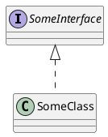

# PlantUML Extension

flexmark-java extension for PlantUML diagram language support in Markdown code.

---

## PlantUML Code Block Node

Single PlantUML code block

```````````````````````````````` example PlantUML Code Block Node: 1
@startuml
    class ArrayList
    interface List
    
    ArrayList ..|> List
@enduml
.
<figure>
  <svg xmlns="http://www.w3.org/2000/svg" xmlns:xlink="http://www.w3.org/1999/xlink" contentStyleType="text/css" height="170px" preserveAspectRatio="none" style="width:106px;height:170px;background:#FFFFFF;" version="1.1" viewBox="0 0 106 170" width="106px" zoomAndPan="magnify">
    <defs/>
    <g>
      <!--class ArrayList-->
      <g id="elem_ArrayList">
        <rect codeLine="1" fill="#F1F1F1" height="48" id="ArrayList" rx="2.5" ry="2.5" style="stroke:#181818;stroke-width:0.5;" width="92" x="7" y="7"/>
        <ellipse cx="22" cy="23" fill="#ADD1B2" rx="11" ry="11" style="stroke:#181818;stroke-width:1.0;"/>
        <path d="M24.4731,29.1431 Q23.8921,29.4419 23.2529,29.5913 Q22.6138,29.7407 21.9082,29.7407 Q19.4014,29.7407 18.0815,28.0889 Q16.7617,26.437 16.7617,23.3159 Q16.7617,20.1865 18.0815,18.5347 Q19.4014,16.8828 21.9082,16.8828 Q22.6138,16.8828 23.2612,17.0322 Q23.9087,17.1816 24.4731,17.4805 L24.4731,20.2031 Q23.8423,19.6221 23.2488,19.3523 Q22.6553,19.0825 22.0244,19.0825 Q20.6797,19.0825 19.9949,20.1492 Q19.3101,21.2158 19.3101,23.3159 Q19.3101,25.4077 19.9949,26.4744 Q20.6797,27.541 22.0244,27.541 Q22.6553,27.541 23.2488,27.2712 Q23.8423,27.0015 24.4731,26.4204 Z " fill="#000000"/>
        <text fill="#000000" font-family="sans-serif" font-size="14" lengthAdjust="spacing" textLength="60" x="36" y="28.291">ArrayList</text>
        <line style="stroke:#181818;stroke-width:0.5;" x1="8" x2="98" y1="39" y2="39"/>
        <line style="stroke:#181818;stroke-width:0.5;" x1="8" x2="98" y1="47" y2="47"/>
      </g>
      <!--class List-->
      <g id="elem_List">
        <rect codeLine="2" fill="#F1F1F1" height="48" id="List" rx="2.5" ry="2.5" style="stroke:#181818;stroke-width:0.5;" width="55" x="25.5" y="115"/>
        <ellipse cx="40.5" cy="131" fill="#B4A7E5" rx="11" ry="11" style="stroke:#181818;stroke-width:1.0;"/>
        <path d="M36.9277,127.2651 L36.9277,125.1069 L44.3071,125.1069 L44.3071,127.2651 L41.8418,127.2651 L41.8418,135.3418 L44.3071,135.3418 L44.3071,137.5 L36.9277,137.5 L36.9277,135.3418 L39.3931,135.3418 L39.3931,127.2651 Z " fill="#000000"/>
        <text fill="#000000" font-family="sans-serif" font-size="14" font-style="italic" lengthAdjust="spacing" textLength="23" x="54.5" y="136.291">List</text>
        <line style="stroke:#181818;stroke-width:0.5;" x1="26.5" x2="79.5" y1="147" y2="147"/>
        <line style="stroke:#181818;stroke-width:0.5;" x1="26.5" x2="79.5" y1="155" y2="155"/>
      </g>
      <!--link ArrayList to List-->
      <g id="link_ArrayList_List">
        <path codeLine="4" d="M53,55.26 C53,72.94 53,79.13 53,96.79 " fill="none" id="ArrayList-to-List" style="stroke:#181818;stroke-width:1.0;stroke-dasharray:7.0,7.0;"/>
        <polygon fill="none" points="53,114.79,59,96.79,47,96.79,53,114.79" style="stroke:#181818;stroke-width:1.0;"/>
      </g>
      <!--SRC=[Kr1GK4ZEIImkLd0iAagizCaiBk422YbavfMa5gKb9gSgW8N0Od0L2dfwDNPW2G00]-->
    </g>
  </svg>
</figure>
.
Document[0, 85]
  PlantUmlBlockNode[0, 85]
````````````````````````````````


Invalid PlantUML code block

```````````````````````````````` example PlantUML Code Block Node: 2
@startuml
    class ArrayList
    interface List
    
    ArrayList ..|> List
@endsomething
.
<p>@startuml
class ArrayList
interface List</p>
<pre><code>ArrayList ..|&gt; List
</code></pre>
<p>@endsomething</p>
.
Document[0, 91]
  Paragraph[0, 49] isTrailingBlankLine
    Text[0, 9] chars:[0, 9, "@startuml"]
    SoftLineBreak[9, 10]
    Text[14, 29] chars:[14, 29, "class … yList"]
    SoftLineBreak[29, 30]
    Text[34, 48] chars:[34, 48, "inter …  List"]
  IndentedCodeBlock[58, 78]
  Paragraph[78, 91]
    Text[78, 91] chars:[78, 91, "@ends … thing"]
````````````````````````````````

PlantUML code block with context

```````````````````````````````` example PlantUML Code Block Node: 3
# Heading

Some text
in a paragraph.

@startuml
    class ArrayList
    interface List
    
    ArrayList ..|> List
@enduml

Another paragraph.
.
<h1>Heading</h1>
<p>Some text
in a paragraph.</p>
<figure>
  <svg xmlns="http://www.w3.org/2000/svg" xmlns:xlink="http://www.w3.org/1999/xlink" contentStyleType="text/css" height="170px" preserveAspectRatio="none" style="width:106px;height:170px;background:#FFFFFF;" version="1.1" viewBox="0 0 106 170" width="106px" zoomAndPan="magnify">
    <defs/>
    <g>
      <!--class ArrayList-->
      <g id="elem_ArrayList">
        <rect codeLine="1" fill="#F1F1F1" height="48" id="ArrayList" rx="2.5" ry="2.5" style="stroke:#181818;stroke-width:0.5;" width="92" x="7" y="7"/>
        <ellipse cx="22" cy="23" fill="#ADD1B2" rx="11" ry="11" style="stroke:#181818;stroke-width:1.0;"/>
        <path d="M24.4731,29.1431 Q23.8921,29.4419 23.2529,29.5913 Q22.6138,29.7407 21.9082,29.7407 Q19.4014,29.7407 18.0815,28.0889 Q16.7617,26.437 16.7617,23.3159 Q16.7617,20.1865 18.0815,18.5347 Q19.4014,16.8828 21.9082,16.8828 Q22.6138,16.8828 23.2612,17.0322 Q23.9087,17.1816 24.4731,17.4805 L24.4731,20.2031 Q23.8423,19.6221 23.2488,19.3523 Q22.6553,19.0825 22.0244,19.0825 Q20.6797,19.0825 19.9949,20.1492 Q19.3101,21.2158 19.3101,23.3159 Q19.3101,25.4077 19.9949,26.4744 Q20.6797,27.541 22.0244,27.541 Q22.6553,27.541 23.2488,27.2712 Q23.8423,27.0015 24.4731,26.4204 Z " fill="#000000"/>
        <text fill="#000000" font-family="sans-serif" font-size="14" lengthAdjust="spacing" textLength="60" x="36" y="28.291">ArrayList</text>
        <line style="stroke:#181818;stroke-width:0.5;" x1="8" x2="98" y1="39" y2="39"/>
        <line style="stroke:#181818;stroke-width:0.5;" x1="8" x2="98" y1="47" y2="47"/>
      </g>
      <!--class List-->
      <g id="elem_List">
        <rect codeLine="2" fill="#F1F1F1" height="48" id="List" rx="2.5" ry="2.5" style="stroke:#181818;stroke-width:0.5;" width="55" x="25.5" y="115"/>
        <ellipse cx="40.5" cy="131" fill="#B4A7E5" rx="11" ry="11" style="stroke:#181818;stroke-width:1.0;"/>
        <path d="M36.9277,127.2651 L36.9277,125.1069 L44.3071,125.1069 L44.3071,127.2651 L41.8418,127.2651 L41.8418,135.3418 L44.3071,135.3418 L44.3071,137.5 L36.9277,137.5 L36.9277,135.3418 L39.3931,135.3418 L39.3931,127.2651 Z " fill="#000000"/>
        <text fill="#000000" font-family="sans-serif" font-size="14" font-style="italic" lengthAdjust="spacing" textLength="23" x="54.5" y="136.291">List</text>
        <line style="stroke:#181818;stroke-width:0.5;" x1="26.5" x2="79.5" y1="147" y2="147"/>
        <line style="stroke:#181818;stroke-width:0.5;" x1="26.5" x2="79.5" y1="155" y2="155"/>
      </g>
      <!--link ArrayList to List-->
      <g id="link_ArrayList_List">
        <path codeLine="4" d="M53,55.26 C53,72.94 53,79.13 53,96.79 " fill="none" id="ArrayList-to-List" style="stroke:#181818;stroke-width:1.0;stroke-dasharray:7.0,7.0;"/>
        <polygon fill="none" points="53,114.79,59,96.79,47,96.79,53,114.79" style="stroke:#181818;stroke-width:1.0;"/>
      </g>
      <!--SRC=[Kr1GK4ZEIImkLd0iAagizCaiBk422YbavfMa5gKb9gSgW8N0Od0L2dfwDNPW2G00]-->
    </g>
  </svg>
</figure>
<p>Another paragraph.</p>
.
Document[0, 143]
  Heading[0, 9] textOpen:[0, 1, "#"] text:[2, 9, "Heading"]
    Text[2, 9] chars:[2, 9, "Heading"]
  Paragraph[11, 37] isTrailingBlankLine
    Text[11, 20] chars:[11, 20, "Some text"]
    SoftLineBreak[20, 21]
    Text[21, 36] chars:[21, 36, "in a  … raph."]
  PlantUmlBlockNode[38, 124]
  Paragraph[125, 143]
    Text[125, 143] chars:[125, 143, "Anoth … raph."]
````````````````````````````````

---

## PlantUML Fenced Code Block Node

Single fenced PlantUML code block

```````````````````````````````` example PlantUML Fenced Code Block Node: 1

.
<figure>
  <svg xmlns="http://www.w3.org/2000/svg" xmlns:xlink="http://www.w3.org/1999/xlink" contentStyleType="text/css" height="170px" preserveAspectRatio="none" style="width:144px;height:170px;background:#FFFFFF;" version="1.1" viewBox="0 0 144 170" width="144px" zoomAndPan="magnify">
    <defs/>
    <g>
      <!--class SomeInterface-->
      <g id="elem_SomeInterface">
        <rect codeLine="1" fill="#F1F1F1" height="48" id="SomeInterface" rx="2.5" ry="2.5" style="stroke:#181818;stroke-width:0.5;" width="130" x="7" y="7"/>
        <ellipse cx="22" cy="23" fill="#B4A7E5" rx="11" ry="11" style="stroke:#181818;stroke-width:1.0;"/>
        <path d="M18.4277,19.2651 L18.4277,17.1069 L25.8071,17.1069 L25.8071,19.2651 L23.3418,19.2651 L23.3418,27.3418 L25.8071,27.3418 L25.8071,29.5 L18.4277,29.5 L18.4277,27.3418 L20.8931,27.3418 L20.8931,19.2651 Z " fill="#000000"/>
        <text fill="#000000" font-family="sans-serif" font-size="14" font-style="italic" lengthAdjust="spacing" textLength="98" x="36" y="28.291">SomeInterface</text>
        <line style="stroke:#181818;stroke-width:0.5;" x1="8" x2="136" y1="39" y2="39"/>
        <line style="stroke:#181818;stroke-width:0.5;" x1="8" x2="136" y1="47" y2="47"/>
      </g>
      <!--class SomeClass-->
      <g id="elem_SomeClass">
        <rect fill="#F1F1F1" height="48" id="SomeClass" rx="2.5" ry="2.5" style="stroke:#181818;stroke-width:0.5;" width="106" x="19" y="115"/>
        <ellipse cx="34" cy="131" fill="#ADD1B2" rx="11" ry="11" style="stroke:#181818;stroke-width:1.0;"/>
        <path d="M36.4731,137.1431 Q35.8921,137.4419 35.2529,137.5913 Q34.6138,137.7407 33.9082,137.7407 Q31.4014,137.7407 30.0815,136.0889 Q28.7617,134.437 28.7617,131.3159 Q28.7617,128.1865 30.0815,126.5347 Q31.4014,124.8828 33.9082,124.8828 Q34.6138,124.8828 35.2612,125.0322 Q35.9087,125.1816 36.4731,125.4805 L36.4731,128.2031 Q35.8423,127.6221 35.2488,127.3523 Q34.6553,127.0825 34.0244,127.0825 Q32.6797,127.0825 31.9949,128.1492 Q31.3101,129.2158 31.3101,131.3159 Q31.3101,133.4077 31.9949,134.4744 Q32.6797,135.541 34.0244,135.541 Q34.6553,135.541 35.2488,135.2712 Q35.8423,135.0015 36.4731,134.4204 Z " fill="#000000"/>
        <text fill="#000000" font-family="sans-serif" font-size="14" lengthAdjust="spacing" textLength="74" x="48" y="136.291">SomeClass</text>
        <line style="stroke:#181818;stroke-width:0.5;" x1="20" x2="124" y1="147" y2="147"/>
        <line style="stroke:#181818;stroke-width:0.5;" x1="20" x2="124" y1="155" y2="155"/>
      </g>
      <!--reverse link SomeInterface to SomeClass-->
      <g id="link_SomeInterface_SomeClass">
        <path codeLine="2" d="M72,73.26 C72,90.94 72,97.13 72,114.79 " fill="none" id="SomeInterface-backto-SomeClass" style="stroke:#181818;stroke-width:1.0;stroke-dasharray:7.0,7.0;"/>
        <polygon fill="none" points="72,55.26,66,73.26,78,73.26,72,55.26" style="stroke:#181818;stroke-width:1.0;"/>
      </g>
      <!--SRC=[Kr38p2j9BKfBJ4vL2CxFJVM4yRWKKFaADZLwUc0Xvvp4uc80]-->
    </g>
  </svg>
</figure>
.
Document[0, 90]
  PlantUmlFencedCodeBlockNode[0, 90] open:[0, 3, "```"] info:[3, 11, "plantuml"] content:[12, 87] lines[4] close:[87, 90, "```"]
    Text[12, 87] chars:[12, 87, "@star … duml\n"]
````````````````````````````````

Single fenced non-PlantUML code block

```````````````````````````````` example PlantUML Fenced Code Block Node: 2
```
@startuml
  interface SomeInterface
  SomeInterface <|.. SomeClass
@enduml
```
.
<pre><code>@startuml
  interface SomeInterface
  SomeInterface &lt;|.. SomeClass
@enduml
</code></pre>
.
Document[0, 82]
  FencedCodeBlock[0, 82] open:[0, 3, "```"] content:[4, 79] lines[4] close:[79, 82, "```"]
    Text[4, 79] chars:[4, 79, "@star … duml\n"]
````````````````````````````````

