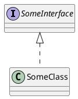

# PlantUML Extension

flexmark-java extension for PlantUML diagram language support in Markdown code.

---

## PlantUML Code Block Node

Single PlantUML code block

```````````````````````````````` example PlantUML Code Block Node: 1
@startuml
    class ArrayList
    interface List
    
    ArrayList ..|> List
@enduml
.
<figure>
  <svg xmlns="http://www.w3.org/2000/svg" xmlns:xlink="http://www.w3.org/1999/xlink" contentStyleType="text/css" data-diagram-type="CLASS" style="background: #FFFFFF; max-width: 100%;" version="1.1" viewBox="0 0 106 170" width="106px" zoomAndPan="magnify">
    <defs/>
    <g>
      <!--class ArrayList-->
      <g class="entity" data-entity="ArrayList" data-source-line="1" data-uid="ent0002" id="entity_ArrayList">
        <rect fill="#F1F1F1" height="48" rx="2.5" ry="2.5" style="stroke:#181818;stroke-width:0.5;" width="92.0469" x="7" y="7"/>
        <ellipse cx="22" cy="23" fill="#ADD1B2" rx="11" ry="11" style="stroke:#181818;stroke-width:1;"/>
        <path d="M24.4731,29.1431 Q23.8921,29.4419 23.2529,29.5913 Q22.6138,29.7407 21.9082,29.7407 Q19.4014,29.7407 18.0815,28.0889 Q16.7617,26.437 16.7617,23.3159 Q16.7617,20.1865 18.0815,18.5347 Q19.4014,16.8828 21.9082,16.8828 Q22.6138,16.8828 23.2612,17.0322 Q23.9087,17.1816 24.4731,17.4805 L24.4731,20.2031 Q23.8423,19.6221 23.2488,19.3523 Q22.6553,19.0825 22.0244,19.0825 Q20.6797,19.0825 19.9949,20.1492 Q19.3101,21.2158 19.3101,23.3159 Q19.3101,25.4077 19.9949,26.4744 Q20.6797,27.541 22.0244,27.541 Q22.6553,27.541 23.2488,27.2712 Q23.8423,27.0015 24.4731,26.4204 Z " fill="#000000"/>
        <text fill="#000000" font-family="sans-serif" font-size="14" lengthAdjust="spacing" textLength="60.0469" x="36" y="28.291">ArrayList</text>
        <line style="stroke:#181818;stroke-width:0.5;" x1="8" x2="98.0469" y1="39" y2="39"/>
        <line style="stroke:#181818;stroke-width:0.5;" x1="8" x2="98.0469" y1="47" y2="47"/>
      </g>
      <!--class List-->
      <g class="entity" data-entity="List" data-source-line="2" data-uid="ent0003" id="entity_List">
        <rect fill="#F1F1F1" height="48" rx="2.5" ry="2.5" style="stroke:#181818;stroke-width:0.5;" width="55.8848" x="25.08" y="115"/>
        <ellipse cx="40.08" cy="131" fill="#B4A7E5" rx="11" ry="11" style="stroke:#181818;stroke-width:1;"/>
        <path d="M36.5077,127.2651 L36.5077,125.1069 L43.8871,125.1069 L43.8871,127.2651 L41.4218,127.2651 L41.4218,135.3418 L43.8871,135.3418 L43.8871,137.5 L36.5077,137.5 L36.5077,135.3418 L38.9731,135.3418 L38.9731,127.2651 Z " fill="#000000"/>
        <text fill="#000000" font-family="sans-serif" font-size="14" font-style="italic" lengthAdjust="spacing" textLength="23.8848" x="54.08" y="136.291">List</text>
        <line style="stroke:#181818;stroke-width:0.5;" x1="26.08" x2="79.9648" y1="147" y2="147"/>
        <line style="stroke:#181818;stroke-width:0.5;" x1="26.08" x2="79.9648" y1="155" y2="155"/>
      </g>
      <!--link ArrayList to List-->
      <g class="link" data-entity-1="ArrayList" data-entity-2="List" data-source-line="4" data-uid="lnk4" id="link_ArrayList_List">
        <path codeLine="4" d="M53.02,55.26 C53.02,72.94 53.02,79.13 53.02,96.79" fill="none" id="ArrayList-to-List" style="stroke:#181818;stroke-width:1;stroke-dasharray:7,7;"/>
        <polygon fill="none" points="53.02,114.79,59.02,96.79,47.02,96.79,53.02,114.79" style="stroke:#181818;stroke-width:1;"/>
      </g>
      <!--SRC=[Kr1GK4ZEIImkLd0iAagizCaiBk422YbavfMa5gKb9gSgm8N015oLWfvUZHrO4W00]-->
    </g>
  </svg>
</figure>
.
Document[0, 85]
  PlantUmlBlockNode[0, 85]
````````````````````````````````


Invalid PlantUML code block

```````````````````````````````` example PlantUML Code Block Node: 2
@startuml
    class ArrayList
    interface List
    
    ArrayList ..|> List
@endsomething
.
<p>@startuml
class ArrayList
interface List</p>
<pre><code>ArrayList ..|&gt; List
</code></pre>
<p>@endsomething</p>
.
Document[0, 91]
  Paragraph[0, 49] isTrailingBlankLine
    Text[0, 9] chars:[0, 9, "@startuml"]
    SoftLineBreak[9, 10]
    Text[14, 29] chars:[14, 29, "class … yList"]
    SoftLineBreak[29, 30]
    Text[34, 48] chars:[34, 48, "inter …  List"]
  IndentedCodeBlock[58, 78]
  Paragraph[78, 91]
    Text[78, 91] chars:[78, 91, "@ends … thing"]
````````````````````````````````

PlantUML code block with context

```````````````````````````````` example PlantUML Code Block Node: 3
# Heading

Some text
in a paragraph.

@startuml
    class ArrayList
    interface List
    
    ArrayList ..|> List
@enduml

Another paragraph.
.
<h1>Heading</h1>
<p>Some text
in a paragraph.</p>
<figure>
  <svg xmlns="http://www.w3.org/2000/svg" xmlns:xlink="http://www.w3.org/1999/xlink" contentStyleType="text/css" data-diagram-type="CLASS" style="background: #FFFFFF; max-width: 100%;" version="1.1" viewBox="0 0 106 170" width="106px" zoomAndPan="magnify">
    <defs/>
    <g>
      <!--class ArrayList-->
      <g class="entity" data-entity="ArrayList" data-source-line="1" data-uid="ent0002" id="entity_ArrayList">
        <rect fill="#F1F1F1" height="48" rx="2.5" ry="2.5" style="stroke:#181818;stroke-width:0.5;" width="92.0469" x="7" y="7"/>
        <ellipse cx="22" cy="23" fill="#ADD1B2" rx="11" ry="11" style="stroke:#181818;stroke-width:1;"/>
        <path d="M24.4731,29.1431 Q23.8921,29.4419 23.2529,29.5913 Q22.6138,29.7407 21.9082,29.7407 Q19.4014,29.7407 18.0815,28.0889 Q16.7617,26.437 16.7617,23.3159 Q16.7617,20.1865 18.0815,18.5347 Q19.4014,16.8828 21.9082,16.8828 Q22.6138,16.8828 23.2612,17.0322 Q23.9087,17.1816 24.4731,17.4805 L24.4731,20.2031 Q23.8423,19.6221 23.2488,19.3523 Q22.6553,19.0825 22.0244,19.0825 Q20.6797,19.0825 19.9949,20.1492 Q19.3101,21.2158 19.3101,23.3159 Q19.3101,25.4077 19.9949,26.4744 Q20.6797,27.541 22.0244,27.541 Q22.6553,27.541 23.2488,27.2712 Q23.8423,27.0015 24.4731,26.4204 Z " fill="#000000"/>
        <text fill="#000000" font-family="sans-serif" font-size="14" lengthAdjust="spacing" textLength="60.0469" x="36" y="28.291">ArrayList</text>
        <line style="stroke:#181818;stroke-width:0.5;" x1="8" x2="98.0469" y1="39" y2="39"/>
        <line style="stroke:#181818;stroke-width:0.5;" x1="8" x2="98.0469" y1="47" y2="47"/>
      </g>
      <!--class List-->
      <g class="entity" data-entity="List" data-source-line="2" data-uid="ent0003" id="entity_List">
        <rect fill="#F1F1F1" height="48" rx="2.5" ry="2.5" style="stroke:#181818;stroke-width:0.5;" width="55.8848" x="25.08" y="115"/>
        <ellipse cx="40.08" cy="131" fill="#B4A7E5" rx="11" ry="11" style="stroke:#181818;stroke-width:1;"/>
        <path d="M36.5077,127.2651 L36.5077,125.1069 L43.8871,125.1069 L43.8871,127.2651 L41.4218,127.2651 L41.4218,135.3418 L43.8871,135.3418 L43.8871,137.5 L36.5077,137.5 L36.5077,135.3418 L38.9731,135.3418 L38.9731,127.2651 Z " fill="#000000"/>
        <text fill="#000000" font-family="sans-serif" font-size="14" font-style="italic" lengthAdjust="spacing" textLength="23.8848" x="54.08" y="136.291">List</text>
        <line style="stroke:#181818;stroke-width:0.5;" x1="26.08" x2="79.9648" y1="147" y2="147"/>
        <line style="stroke:#181818;stroke-width:0.5;" x1="26.08" x2="79.9648" y1="155" y2="155"/>
      </g>
      <!--link ArrayList to List-->
      <g class="link" data-entity-1="ArrayList" data-entity-2="List" data-source-line="4" data-uid="lnk4" id="link_ArrayList_List">
        <path codeLine="4" d="M53.02,55.26 C53.02,72.94 53.02,79.13 53.02,96.79" fill="none" id="ArrayList-to-List" style="stroke:#181818;stroke-width:1;stroke-dasharray:7,7;"/>
        <polygon fill="none" points="53.02,114.79,59.02,96.79,47.02,96.79,53.02,114.79" style="stroke:#181818;stroke-width:1;"/>
      </g>
      <!--SRC=[Kr1GK4ZEIImkLd0iAagizCaiBk422YbavfMa5gKb9gSgm8N015oLWfvUZHrO4W00]-->
    </g>
  </svg>
</figure>
<p>Another paragraph.</p>
.
Document[0, 143]
  Heading[0, 9] textOpen:[0, 1, "#"] text:[2, 9, "Heading"]
    Text[2, 9] chars:[2, 9, "Heading"]
  Paragraph[11, 37] isTrailingBlankLine
    Text[11, 20] chars:[11, 20, "Some text"]
    SoftLineBreak[20, 21]
    Text[21, 36] chars:[21, 36, "in a  … raph."]
  PlantUmlBlockNode[38, 123]
  Paragraph[125, 143]
    Text[125, 143] chars:[125, 143, "Anoth … raph."]
````````````````````````````````

Single PlantUML code block with empty line following

```````````````````````````````` example PlantUML Code Block Node: 4
@startuml
    class ArrayList
    interface List
    
    ArrayList ..|> List
@enduml

.
<figure>
  <svg xmlns="http://www.w3.org/2000/svg" xmlns:xlink="http://www.w3.org/1999/xlink" contentStyleType="text/css" data-diagram-type="CLASS" style="background: #FFFFFF; max-width: 100%;" version="1.1" viewBox="0 0 106 170" width="106px" zoomAndPan="magnify">
    <defs/>
    <g>
      <!--class ArrayList-->
      <g class="entity" data-entity="ArrayList" data-source-line="1" data-uid="ent0002" id="entity_ArrayList">
        <rect fill="#F1F1F1" height="48" rx="2.5" ry="2.5" style="stroke:#181818;stroke-width:0.5;" width="92.0469" x="7" y="7"/>
        <ellipse cx="22" cy="23" fill="#ADD1B2" rx="11" ry="11" style="stroke:#181818;stroke-width:1;"/>
        <path d="M24.4731,29.1431 Q23.8921,29.4419 23.2529,29.5913 Q22.6138,29.7407 21.9082,29.7407 Q19.4014,29.7407 18.0815,28.0889 Q16.7617,26.437 16.7617,23.3159 Q16.7617,20.1865 18.0815,18.5347 Q19.4014,16.8828 21.9082,16.8828 Q22.6138,16.8828 23.2612,17.0322 Q23.9087,17.1816 24.4731,17.4805 L24.4731,20.2031 Q23.8423,19.6221 23.2488,19.3523 Q22.6553,19.0825 22.0244,19.0825 Q20.6797,19.0825 19.9949,20.1492 Q19.3101,21.2158 19.3101,23.3159 Q19.3101,25.4077 19.9949,26.4744 Q20.6797,27.541 22.0244,27.541 Q22.6553,27.541 23.2488,27.2712 Q23.8423,27.0015 24.4731,26.4204 Z " fill="#000000"/>
        <text fill="#000000" font-family="sans-serif" font-size="14" lengthAdjust="spacing" textLength="60.0469" x="36" y="28.291">ArrayList</text>
        <line style="stroke:#181818;stroke-width:0.5;" x1="8" x2="98.0469" y1="39" y2="39"/>
        <line style="stroke:#181818;stroke-width:0.5;" x1="8" x2="98.0469" y1="47" y2="47"/>
      </g>
      <!--class List-->
      <g class="entity" data-entity="List" data-source-line="2" data-uid="ent0003" id="entity_List">
        <rect fill="#F1F1F1" height="48" rx="2.5" ry="2.5" style="stroke:#181818;stroke-width:0.5;" width="55.8848" x="25.08" y="115"/>
        <ellipse cx="40.08" cy="131" fill="#B4A7E5" rx="11" ry="11" style="stroke:#181818;stroke-width:1;"/>
        <path d="M36.5077,127.2651 L36.5077,125.1069 L43.8871,125.1069 L43.8871,127.2651 L41.4218,127.2651 L41.4218,135.3418 L43.8871,135.3418 L43.8871,137.5 L36.5077,137.5 L36.5077,135.3418 L38.9731,135.3418 L38.9731,127.2651 Z " fill="#000000"/>
        <text fill="#000000" font-family="sans-serif" font-size="14" font-style="italic" lengthAdjust="spacing" textLength="23.8848" x="54.08" y="136.291">List</text>
        <line style="stroke:#181818;stroke-width:0.5;" x1="26.08" x2="79.9648" y1="147" y2="147"/>
        <line style="stroke:#181818;stroke-width:0.5;" x1="26.08" x2="79.9648" y1="155" y2="155"/>
      </g>
      <!--link ArrayList to List-->
      <g class="link" data-entity-1="ArrayList" data-entity-2="List" data-source-line="4" data-uid="lnk4" id="link_ArrayList_List">
        <path codeLine="4" d="M53.02,55.26 C53.02,72.94 53.02,79.13 53.02,96.79" fill="none" id="ArrayList-to-List" style="stroke:#181818;stroke-width:1;stroke-dasharray:7,7;"/>
        <polygon fill="none" points="53.02,114.79,59.02,96.79,47.02,96.79,53.02,114.79" style="stroke:#181818;stroke-width:1;"/>
      </g>
      <!--SRC=[Kr1GK4ZEIImkLd0iAagizCaiBk422YbavfMa5gKb9gSgm8N015oLWfvUZHrO4W00]-->
    </g>
  </svg>
</figure>
.
Document[0, 87]
  PlantUmlBlockNode[0, 85]
````````````````````````````````

PlantUML code block with timing diagram

```````````````````````````````` example PlantUML Code Block Node: 5
# Timing diagram example

@startuml
robust "DNS Resolver" as DNS
robust "Web Browser" as WB
concise "Web User" as WU

@0
WU is Idle
WB is Idle
DNS is Idle

@+100
WU -> WB : URL
WU is Waiting
WB is Processing

@+200
WB is Waiting
WB -> DNS@+50 : Resolve URL

@+100
DNS is Processing

@+300
DNS is Idle
@enduml

A paragraph following.
.
<h1>Timing diagram example</h1>
<figure>
  <svg xmlns="http://www.w3.org/2000/svg" xmlns:xlink="http://www.w3.org/1999/xlink" contentStyleType="text/css" data-diagram-type="TIMING" style="background: #FFFFFF; max-width: 100%;" version="1.1" viewBox="0 0 499 225" width="499px" zoomAndPan="magnify">
    <defs/>
    <g>
      <line style="stroke:#333333;stroke-width:0.5;" x1="10" x2="10" y1="10" y2="195.4648"/>
      <line style="stroke:#333333;stroke-width:0.5;" x1="482.3789" x2="482.3789" y1="10" y2="195.4648"/>
      <line style="stroke:#333333;stroke-width:0.5;stroke-dasharray:3,5;" x1="77.3789" x2="77.3789" y1="10" y2="195.4648"/>
      <line style="stroke:#333333;stroke-width:0.5;stroke-dasharray:3,5;" x1="127.3789" x2="127.3789" y1="10" y2="195.4648"/>
      <line style="stroke:#333333;stroke-width:0.5;stroke-dasharray:3,5;" x1="177.3789" x2="177.3789" y1="10" y2="195.4648"/>
      <line style="stroke:#333333;stroke-width:0.5;stroke-dasharray:3,5;" x1="227.3789" x2="227.3789" y1="10" y2="195.4648"/>
      <line style="stroke:#333333;stroke-width:0.5;stroke-dasharray:3,5;" x1="277.3789" x2="277.3789" y1="10" y2="195.4648"/>
      <line style="stroke:#333333;stroke-width:0.5;stroke-dasharray:3,5;" x1="327.3789" x2="327.3789" y1="10" y2="195.4648"/>
      <line style="stroke:#333333;stroke-width:0.5;stroke-dasharray:3,5;" x1="377.3789" x2="377.3789" y1="10" y2="195.4648"/>
      <line style="stroke:#333333;stroke-width:0.5;stroke-dasharray:3,5;" x1="427.3789" x2="427.3789" y1="10" y2="195.4648"/>
      <line style="stroke:#333333;stroke-width:0.5;stroke-dasharray:3,5;" x1="477.3789" x2="477.3789" y1="10" y2="195.4648"/>
      <line style="stroke:#333333;stroke-width:0.5;" x1="10" x2="482.3789" y1="10" y2="10"/>
      <text fill="#333333" font-family="sans-serif" font-size="14" font-weight="bold" lengthAdjust="spacing" textLength="96.6191" x="15" y="23.5352">DNS Resolver</text>
      <line style="stroke:#333333;stroke-width:0.5;" x1="10" x2="112.6191" y1="27.4883" y2="27.4883"/>
      <line style="stroke:#333333;stroke-width:0.5;" x1="112.6191" x2="122.6191" y1="27.4883" y2="10"/>
      <text fill="#333333" font-family="sans-serif" font-size="12" lengthAdjust="spacing" textLength="21.1641" x="15" y="58.0234">Idle</text>
      <text fill="#333333" font-family="sans-serif" font-size="12" lengthAdjust="spacing" textLength="62.3789" x="15" y="38.0234">Processing</text>
      <line style="stroke:#006400;stroke-width:2;" x1="77.3789" x2="277.3789" y1="52.4883" y2="52.4883"/>
      <line style="stroke:#006400;stroke-width:2;" x1="277.3789" x2="427.3789" y1="32.4883" y2="32.4883"/>
      <line style="stroke:#006400;stroke-width:2;" x1="427.3789" x2="477.3789" y1="52.4883" y2="52.4883"/>
      <line style="stroke:#006400;stroke-width:2;" x1="277.3789" x2="277.3789" y1="32.4883" y2="52.4883"/>
      <line style="stroke:#006400;stroke-width:2;" x1="427.3789" x2="427.3789" y1="32.4883" y2="52.4883"/>
      <line style="stroke:#333333;stroke-width:0.5;" x1="10" x2="482.3789" y1="64.4883" y2="64.4883"/>
      <text fill="#333333" font-family="sans-serif" font-size="14" font-weight="bold" lengthAdjust="spacing" textLength="93.4336" x="15" y="78.0234">Web Browser</text>
      <line style="stroke:#333333;stroke-width:0.5;" x1="10" x2="109.4336" y1="81.9766" y2="81.9766"/>
      <line style="stroke:#333333;stroke-width:0.5;" x1="109.4336" x2="119.4336" y1="81.9766" y2="64.4883"/>
      <text fill="#333333" font-family="sans-serif" font-size="12" lengthAdjust="spacing" textLength="21.1641" x="15" y="132.5117">Idle</text>
      <text fill="#333333" font-family="sans-serif" font-size="12" lengthAdjust="spacing" textLength="62.3789" x="15" y="112.5117">Processing</text>
      <text fill="#333333" font-family="sans-serif" font-size="12" lengthAdjust="spacing" textLength="43.248" x="15" y="92.5117">Waiting</text>
      <line style="stroke:#006400;stroke-width:2;" x1="77.3789" x2="127.3789" y1="126.9766" y2="126.9766"/>
      <line style="stroke:#006400;stroke-width:2;" x1="127.3789" x2="227.3789" y1="106.9766" y2="106.9766"/>
      <line style="stroke:#006400;stroke-width:2;" x1="227.3789" x2="477.3789" y1="86.9766" y2="86.9766"/>
      <line style="stroke:#006400;stroke-width:2;" x1="127.3789" x2="127.3789" y1="106.9766" y2="126.9766"/>
      <line style="stroke:#006400;stroke-width:2;" x1="227.3789" x2="227.3789" y1="86.9766" y2="106.9766"/>
      <line style="stroke:#333333;stroke-width:0.5;" x1="10" x2="482.3789" y1="138.9766" y2="138.9766"/>
      <text fill="#333333" font-family="sans-serif" font-size="14" font-weight="bold" lengthAdjust="spacing" textLength="67.5391" x="15" y="152.5117">Web User</text>
      <line style="stroke:#333333;stroke-width:0.5;" x1="10" x2="83.5391" y1="156.4648" y2="156.4648"/>
      <line style="stroke:#333333;stroke-width:0.5;" x1="83.5391" x2="93.5391" y1="156.4648" y2="138.9766"/>
      <polygon fill="#E2E2F0" points="89.3789,161.4648,115.3789,161.4648,127.3789,173.4648,115.3789,185.4648,89.3789,185.4648,77.3789,173.4648" style="stroke:#006400;stroke-width:1.5;"/>
      <polygon fill="#E2E2F0" points="139.3789,161.4648,477.3789,161.4648,477.3789,185.4648,139.3789,185.4648,127.3789,173.4648" style="stroke:#E2E2F0;stroke-width:1.5;"/>
      <path d="M477.3789,161.4648 L139.3789,161.4648 L127.3789,173.4648 L139.3789,185.4648 L477.3789,185.4648" fill="#E2E2F0" style="stroke:#006400;stroke-width:1.5;"/>
      <text fill="#333333" font-family="sans-serif" font-size="12" font-weight="bold" lengthAdjust="spacing" textLength="22.8633" x="90.9473" y="178">Idle</text>
      <text fill="#333333" font-family="sans-serif" font-size="12" font-weight="bold" lengthAdjust="spacing" textLength="46.3652" x="139.3789" y="178">Waiting</text>
      <line style="stroke:#333333;stroke-width:2;" x1="77.3789" x2="77.3789" y1="195.4648" y2="200.4648"/>
      <line style="stroke:#333333;stroke-width:2;" x1="127.3789" x2="127.3789" y1="195.4648" y2="200.4648"/>
      <line style="stroke:#333333;stroke-width:2;" x1="177.3789" x2="177.3789" y1="195.4648" y2="200.4648"/>
      <line style="stroke:#333333;stroke-width:2;" x1="227.3789" x2="227.3789" y1="195.4648" y2="200.4648"/>
      <line style="stroke:#333333;stroke-width:2;" x1="277.3789" x2="277.3789" y1="195.4648" y2="200.4648"/>
      <line style="stroke:#333333;stroke-width:2;" x1="327.3789" x2="327.3789" y1="195.4648" y2="200.4648"/>
      <line style="stroke:#333333;stroke-width:2;" x1="377.3789" x2="377.3789" y1="195.4648" y2="200.4648"/>
      <line style="stroke:#333333;stroke-width:2;" x1="427.3789" x2="427.3789" y1="195.4648" y2="200.4648"/>
      <line style="stroke:#333333;stroke-width:2;" x1="477.3789" x2="477.3789" y1="195.4648" y2="200.4648"/>
      <line style="stroke:#333333;stroke-width:2;" x1="77.3789" x2="477.3789" y1="195.4648" y2="195.4648"/>
      <text fill="#333333" font-family="sans-serif" font-size="11" lengthAdjust="spacing" textLength="6.9556" x="73.9011" y="212.0996">0</text>
      <text fill="#333333" font-family="sans-serif" font-size="11" lengthAdjust="spacing" textLength="20.8667" x="116.9456" y="212.0996">100</text>
      <text fill="#333333" font-family="sans-serif" font-size="11" lengthAdjust="spacing" textLength="20.8667" x="216.9456" y="212.0996">300</text>
      <text fill="#333333" font-family="sans-serif" font-size="11" lengthAdjust="spacing" textLength="20.8667" x="266.9456" y="212.0996">400</text>
      <text fill="#333333" font-family="sans-serif" font-size="11" lengthAdjust="spacing" textLength="20.8667" x="416.9456" y="212.0996">700</text>
      <line style="stroke:#00008B;stroke-width:1.5;" x1="127.3789" x2="127.3789" y1="173.4648" y2="126.9766"/>
      <polygon fill="#00008B" points="130.1151,134.4941,124.6427,134.4941,127.3789,126.9766" style="stroke:#00008B;stroke-width:1.5;"/>
      <text fill="#00008B" font-family="Serif" font-size="14" lengthAdjust="spacing" textLength="28" x="127.3789" y="147.5644">URL</text>
      <line style="stroke:#00008B;stroke-width:1.5;" x1="227.3789" x2="252.3789" y1="86.9766" y2="52.4883"/>
      <polygon fill="#00008B" points="250.1822,60.1808,245.7515,56.969,252.3789,52.4883" style="stroke:#00008B;stroke-width:1.5;"/>
      <text fill="#00008B" font-family="Serif" font-size="14" lengthAdjust="spacing" textLength="76.6035" x="247.9668" y="71.6452">Resolve URL</text>
      <!--SRC=[NO_12i8m38RlUOgmwn2guiM3bE954959wNchGGfZXMRgwzlEED5Ro9V_-ziKkpkFMErF5so8O_-WL67Bc1UG13hgqAJuP67EW8-33qnlPcTW0RG2Pp4m7guzWJFpM2e-C-XwgQR3nIxhS8ksEKhEjM4CmqsYvnGzCPT53grAoFnTPKLswtgZiaS-CVcaHOf_JUilA2zw0G00]-->
    </g>
  </svg>
</figure>
<p>A paragraph following.</p>
.
Document[0, 332]
  Heading[0, 24] textOpen:[0, 1, "#"] text:[2, 24, "Timing diagram example"]
    Text[2, 24] chars:[2, 24, "Timin … ample"]
  PlantUmlBlockNode[26, 308]
  Paragraph[310, 332]
    Text[310, 332] chars:[310, 332, "A par … wing."]
````````````````````````````````

---

## PlantUML Fenced Code Block Node

Single fenced PlantUML code block

```````````````````````````````` example PlantUML Fenced Code Block Node: 1

.
<figure>
  <svg xmlns="http://www.w3.org/2000/svg" xmlns:xlink="http://www.w3.org/1999/xlink" contentStyleType="text/css" data-diagram-type="CLASS" style="background: #FFFFFF; max-width: 100%;" version="1.1" viewBox="0 0 142 170" width="142px" zoomAndPan="magnify">
    <defs/>
    <g>
      <!--class SomeInterface-->
      <g class="entity" data-entity="SomeInterface" data-source-line="1" data-uid="ent0002" id="entity_SomeInterface">
        <rect fill="#F1F1F1" height="48" rx="2.5" ry="2.5" style="stroke:#181818;stroke-width:0.5;" width="128.3457" x="7" y="7"/>
        <ellipse cx="22" cy="23" fill="#B4A7E5" rx="11" ry="11" style="stroke:#181818;stroke-width:1;"/>
        <path d="M18.4277,19.2651 L18.4277,17.1069 L25.8071,17.1069 L25.8071,19.2651 L23.3418,19.2651 L23.3418,27.3418 L25.8071,27.3418 L25.8071,29.5 L18.4277,29.5 L18.4277,27.3418 L20.8931,27.3418 L20.8931,19.2651 Z " fill="#000000"/>
        <text fill="#000000" font-family="sans-serif" font-size="14" font-style="italic" lengthAdjust="spacing" textLength="96.3457" x="36" y="28.291">SomeInterface</text>
        <line style="stroke:#181818;stroke-width:0.5;" x1="8" x2="134.3457" y1="39" y2="39"/>
        <line style="stroke:#181818;stroke-width:0.5;" x1="8" x2="134.3457" y1="47" y2="47"/>
      </g>
      <!--class SomeClass-->
      <g class="entity" data-entity="SomeClass" data-source-line="2" data-uid="ent0003" id="entity_SomeClass">
        <rect fill="#F1F1F1" height="48" rx="2.5" ry="2.5" style="stroke:#181818;stroke-width:0.5;" width="104.748" x="18.8" y="115"/>
        <ellipse cx="33.8" cy="131" fill="#ADD1B2" rx="11" ry="11" style="stroke:#181818;stroke-width:1;"/>
        <path d="M36.2731,137.1431 Q35.6921,137.4419 35.0529,137.5913 Q34.4138,137.7407 33.7082,137.7407 Q31.2014,137.7407 29.8815,136.0889 Q28.5617,134.437 28.5617,131.3159 Q28.5617,128.1865 29.8815,126.5347 Q31.2014,124.8828 33.7082,124.8828 Q34.4138,124.8828 35.0612,125.0322 Q35.7087,125.1816 36.2731,125.4805 L36.2731,128.2031 Q35.6423,127.6221 35.0488,127.3523 Q34.4553,127.0825 33.8244,127.0825 Q32.4797,127.0825 31.7949,128.1492 Q31.1101,129.2158 31.1101,131.3159 Q31.1101,133.4077 31.7949,134.4744 Q32.4797,135.541 33.8244,135.541 Q34.4553,135.541 35.0488,135.2712 Q35.6423,135.0015 36.2731,134.4204 Z " fill="#000000"/>
        <text fill="#000000" font-family="sans-serif" font-size="14" lengthAdjust="spacing" textLength="72.748" x="47.8" y="136.291">SomeClass</text>
        <line style="stroke:#181818;stroke-width:0.5;" x1="19.8" x2="122.548" y1="147" y2="147"/>
        <line style="stroke:#181818;stroke-width:0.5;" x1="19.8" x2="122.548" y1="155" y2="155"/>
      </g>
      <!--reverse link SomeInterface to SomeClass-->
      <g class="link" data-entity-1="SomeInterface" data-entity-2="SomeClass" data-source-line="2" data-uid="lnk4" id="link_SomeInterface_SomeClass">
        <path codeLine="2" d="M71.17,73.26 C71.17,90.94 71.17,97.13 71.17,114.79" fill="none" id="SomeInterface-backto-SomeClass" style="stroke:#181818;stroke-width:1;stroke-dasharray:7,7;"/>
        <polygon fill="none" points="71.17,55.26,65.17,73.26,77.17,73.26,71.17,55.26" style="stroke:#181818;stroke-width:1;"/>
      </g>
      <!--SRC=[Kr38p2j9BKfBJ4vL2CxFJVM4yRWKKFaADZLwUc0Xvvp4uc80]-->
    </g>
  </svg>
</figure>
.
Document[0, 90]
  PlantUmlFencedCodeBlockNode[0, 90] open:[0, 3, "```"] info:[3, 11, "plantuml"] content:[12, 87] lines[4] close:[87, 90, "```"]
    Text[12, 87] chars:[12, 87, "@star … duml\n"]
````````````````````````````````

Single fenced non-PlantUML code block

```````````````````````````````` example PlantUML Fenced Code Block Node: 2
```
@startuml
  interface SomeInterface
  SomeInterface <|.. SomeClass
@enduml
```
.
<pre><code>@startuml
  interface SomeInterface
  SomeInterface &lt;|.. SomeClass
@enduml
</code></pre>
.
Document[0, 82]
  FencedCodeBlock[0, 82] open:[0, 3, "```"] content:[4, 79] lines[4] close:[79, 82, "```"]
    Text[4, 79] chars:[4, 79, "@star … duml\n"]
````````````````````````````````

Single fenced non-PlantUML code block with language

```````````````````````````````` example PlantUML Fenced Code Block Node: 3
```plantumlcode
@startuml
  interface SomeInterface
  SomeInterface <|.. SomeClass
@enduml
```
.
<pre><code class="language-plantumlcode">@startuml
  interface SomeInterface
  SomeInterface &lt;|.. SomeClass
@enduml
</code></pre>
.
Document[0, 94]
  FencedCodeBlock[0, 94] open:[0, 3, "```"] info:[3, 15, "plantumlcode"] content:[16, 91] lines[4] close:[91, 94, "```"]
    Text[16, 91] chars:[16, 91, "@star … duml\n"]
````````````````````````````````

Single fenced PlantUML code block with ~ symbols

```````````````````````````````` example PlantUML Fenced Code Block Node: 4
~~~plantuml
@startuml
  interface SomeInterface
  SomeInterface <|.. SomeClass
@enduml
~~~
.
<figure>
  <svg xmlns="http://www.w3.org/2000/svg" xmlns:xlink="http://www.w3.org/1999/xlink" contentStyleType="text/css" data-diagram-type="CLASS" style="background: #FFFFFF; max-width: 100%;" version="1.1" viewBox="0 0 142 170" width="142px" zoomAndPan="magnify">
    <defs/>
    <g>
      <!--class SomeInterface-->
      <g class="entity" data-entity="SomeInterface" data-source-line="1" data-uid="ent0002" id="entity_SomeInterface">
        <rect fill="#F1F1F1" height="48" rx="2.5" ry="2.5" style="stroke:#181818;stroke-width:0.5;" width="128.3457" x="7" y="7"/>
        <ellipse cx="22" cy="23" fill="#B4A7E5" rx="11" ry="11" style="stroke:#181818;stroke-width:1;"/>
        <path d="M18.4277,19.2651 L18.4277,17.1069 L25.8071,17.1069 L25.8071,19.2651 L23.3418,19.2651 L23.3418,27.3418 L25.8071,27.3418 L25.8071,29.5 L18.4277,29.5 L18.4277,27.3418 L20.8931,27.3418 L20.8931,19.2651 Z " fill="#000000"/>
        <text fill="#000000" font-family="sans-serif" font-size="14" font-style="italic" lengthAdjust="spacing" textLength="96.3457" x="36" y="28.291">SomeInterface</text>
        <line style="stroke:#181818;stroke-width:0.5;" x1="8" x2="134.3457" y1="39" y2="39"/>
        <line style="stroke:#181818;stroke-width:0.5;" x1="8" x2="134.3457" y1="47" y2="47"/>
      </g>
      <!--class SomeClass-->
      <g class="entity" data-entity="SomeClass" data-source-line="2" data-uid="ent0003" id="entity_SomeClass">
        <rect fill="#F1F1F1" height="48" rx="2.5" ry="2.5" style="stroke:#181818;stroke-width:0.5;" width="104.748" x="18.8" y="115"/>
        <ellipse cx="33.8" cy="131" fill="#ADD1B2" rx="11" ry="11" style="stroke:#181818;stroke-width:1;"/>
        <path d="M36.2731,137.1431 Q35.6921,137.4419 35.0529,137.5913 Q34.4138,137.7407 33.7082,137.7407 Q31.2014,137.7407 29.8815,136.0889 Q28.5617,134.437 28.5617,131.3159 Q28.5617,128.1865 29.8815,126.5347 Q31.2014,124.8828 33.7082,124.8828 Q34.4138,124.8828 35.0612,125.0322 Q35.7087,125.1816 36.2731,125.4805 L36.2731,128.2031 Q35.6423,127.6221 35.0488,127.3523 Q34.4553,127.0825 33.8244,127.0825 Q32.4797,127.0825 31.7949,128.1492 Q31.1101,129.2158 31.1101,131.3159 Q31.1101,133.4077 31.7949,134.4744 Q32.4797,135.541 33.8244,135.541 Q34.4553,135.541 35.0488,135.2712 Q35.6423,135.0015 36.2731,134.4204 Z " fill="#000000"/>
        <text fill="#000000" font-family="sans-serif" font-size="14" lengthAdjust="spacing" textLength="72.748" x="47.8" y="136.291">SomeClass</text>
        <line style="stroke:#181818;stroke-width:0.5;" x1="19.8" x2="122.548" y1="147" y2="147"/>
        <line style="stroke:#181818;stroke-width:0.5;" x1="19.8" x2="122.548" y1="155" y2="155"/>
      </g>
      <!--reverse link SomeInterface to SomeClass-->
      <g class="link" data-entity-1="SomeInterface" data-entity-2="SomeClass" data-source-line="2" data-uid="lnk4" id="link_SomeInterface_SomeClass">
        <path codeLine="2" d="M71.17,73.26 C71.17,90.94 71.17,97.13 71.17,114.79" fill="none" id="SomeInterface-backto-SomeClass" style="stroke:#181818;stroke-width:1;stroke-dasharray:7,7;"/>
        <polygon fill="none" points="71.17,55.26,65.17,73.26,77.17,73.26,71.17,55.26" style="stroke:#181818;stroke-width:1;"/>
      </g>
      <!--SRC=[Kr38p2j9BKfBJ4vL2CxFJVM4yRWKKFaADZLwUc0Xvvp4uc80]-->
    </g>
  </svg>
</figure>
.
Document[0, 90]
  PlantUmlFencedCodeBlockNode[0, 90] open:[0, 3, "~~~"] info:[3, 11, "plantuml"] content:[12, 87] lines[4] close:[87, 90, "~~~"]
    Text[12, 87] chars:[12, 87, "@star … duml\n"]
````````````````````````````````

Single fenced PlantUML code block, followed by an empty line

```````````````````````````````` example PlantUML Fenced Code Block Node: 5


.
<figure>
  <svg xmlns="http://www.w3.org/2000/svg" xmlns:xlink="http://www.w3.org/1999/xlink" contentStyleType="text/css" data-diagram-type="CLASS" style="background: #FFFFFF; max-width: 100%;" version="1.1" viewBox="0 0 142 170" width="142px" zoomAndPan="magnify">
    <defs/>
    <g>
      <!--class SomeInterface-->
      <g class="entity" data-entity="SomeInterface" data-source-line="1" data-uid="ent0002" id="entity_SomeInterface">
        <rect fill="#F1F1F1" height="48" rx="2.5" ry="2.5" style="stroke:#181818;stroke-width:0.5;" width="128.3457" x="7" y="7"/>
        <ellipse cx="22" cy="23" fill="#B4A7E5" rx="11" ry="11" style="stroke:#181818;stroke-width:1;"/>
        <path d="M18.4277,19.2651 L18.4277,17.1069 L25.8071,17.1069 L25.8071,19.2651 L23.3418,19.2651 L23.3418,27.3418 L25.8071,27.3418 L25.8071,29.5 L18.4277,29.5 L18.4277,27.3418 L20.8931,27.3418 L20.8931,19.2651 Z " fill="#000000"/>
        <text fill="#000000" font-family="sans-serif" font-size="14" font-style="italic" lengthAdjust="spacing" textLength="96.3457" x="36" y="28.291">SomeInterface</text>
        <line style="stroke:#181818;stroke-width:0.5;" x1="8" x2="134.3457" y1="39" y2="39"/>
        <line style="stroke:#181818;stroke-width:0.5;" x1="8" x2="134.3457" y1="47" y2="47"/>
      </g>
      <!--class SomeClass-->
      <g class="entity" data-entity="SomeClass" data-source-line="2" data-uid="ent0003" id="entity_SomeClass">
        <rect fill="#F1F1F1" height="48" rx="2.5" ry="2.5" style="stroke:#181818;stroke-width:0.5;" width="104.748" x="18.8" y="115"/>
        <ellipse cx="33.8" cy="131" fill="#ADD1B2" rx="11" ry="11" style="stroke:#181818;stroke-width:1;"/>
        <path d="M36.2731,137.1431 Q35.6921,137.4419 35.0529,137.5913 Q34.4138,137.7407 33.7082,137.7407 Q31.2014,137.7407 29.8815,136.0889 Q28.5617,134.437 28.5617,131.3159 Q28.5617,128.1865 29.8815,126.5347 Q31.2014,124.8828 33.7082,124.8828 Q34.4138,124.8828 35.0612,125.0322 Q35.7087,125.1816 36.2731,125.4805 L36.2731,128.2031 Q35.6423,127.6221 35.0488,127.3523 Q34.4553,127.0825 33.8244,127.0825 Q32.4797,127.0825 31.7949,128.1492 Q31.1101,129.2158 31.1101,131.3159 Q31.1101,133.4077 31.7949,134.4744 Q32.4797,135.541 33.8244,135.541 Q34.4553,135.541 35.0488,135.2712 Q35.6423,135.0015 36.2731,134.4204 Z " fill="#000000"/>
        <text fill="#000000" font-family="sans-serif" font-size="14" lengthAdjust="spacing" textLength="72.748" x="47.8" y="136.291">SomeClass</text>
        <line style="stroke:#181818;stroke-width:0.5;" x1="19.8" x2="122.548" y1="147" y2="147"/>
        <line style="stroke:#181818;stroke-width:0.5;" x1="19.8" x2="122.548" y1="155" y2="155"/>
      </g>
      <!--reverse link SomeInterface to SomeClass-->
      <g class="link" data-entity-1="SomeInterface" data-entity-2="SomeClass" data-source-line="2" data-uid="lnk4" id="link_SomeInterface_SomeClass">
        <path codeLine="2" d="M71.17,73.26 C71.17,90.94 71.17,97.13 71.17,114.79" fill="none" id="SomeInterface-backto-SomeClass" style="stroke:#181818;stroke-width:1;stroke-dasharray:7,7;"/>
        <polygon fill="none" points="71.17,55.26,65.17,73.26,77.17,73.26,71.17,55.26" style="stroke:#181818;stroke-width:1;"/>
      </g>
      <!--SRC=[Kr38p2j9BKfBJ4vL2CxFJVM4yRWKKFaADZLwUc0Xvvp4uc80]-->
    </g>
  </svg>
</figure>
.
Document[0, 92]
  PlantUmlFencedCodeBlockNode[0, 90] open:[0, 3, "```"] info:[3, 11, "plantuml"] content:[12, 87] lines[4] close:[87, 90, "```"]
    Text[12, 87] chars:[12, 87, "@star … duml\n"]
````````````````````````````````
